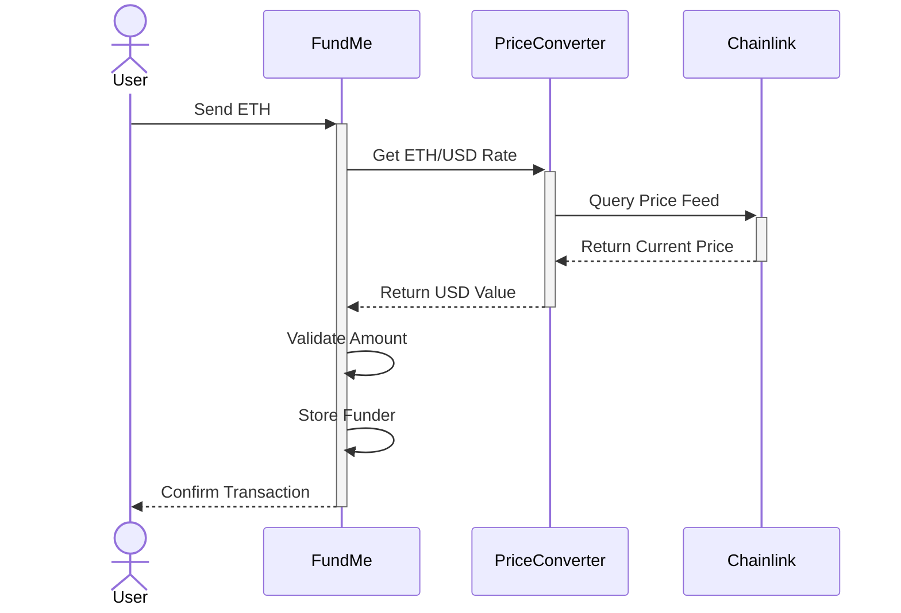
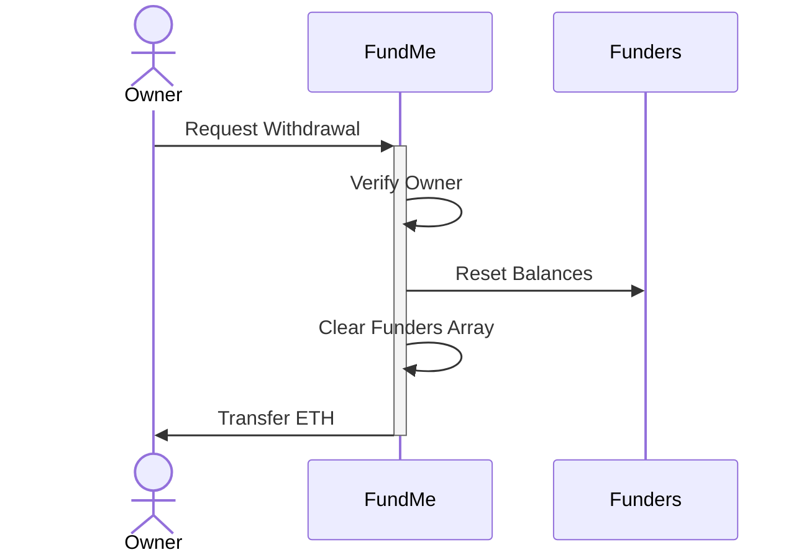
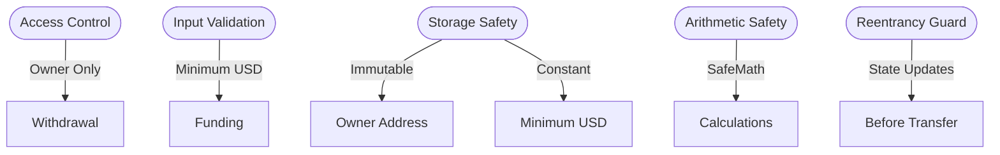
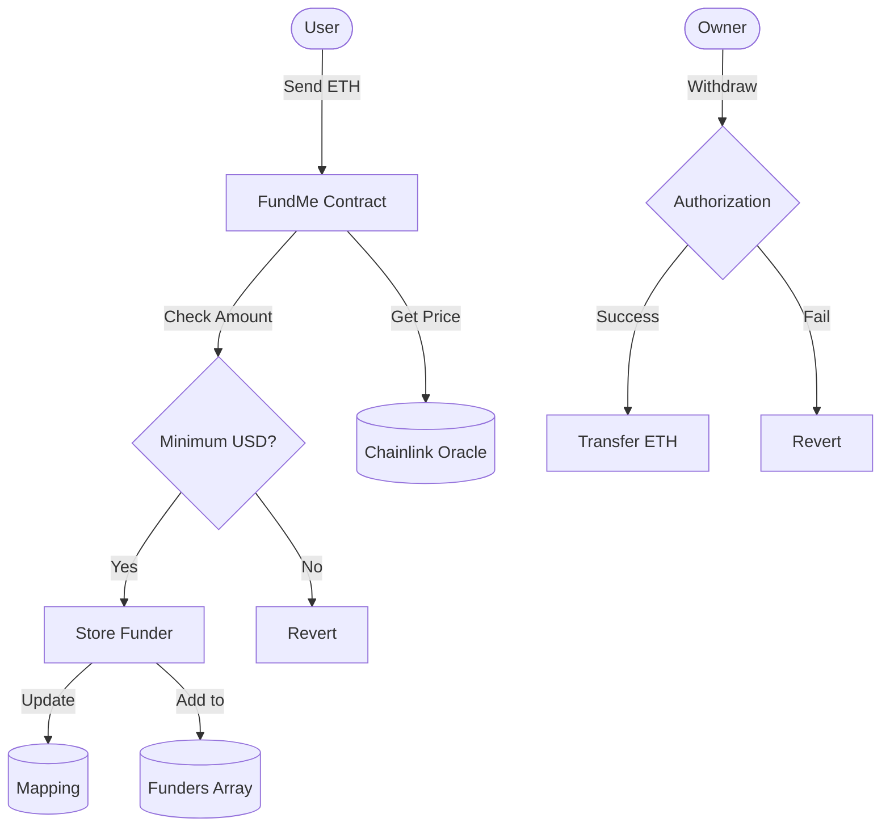

# FundMeEth Smart Contract

[](https://opensource.org/licenses/MIT)
[](https://soliditylang.org/)
[](https://sepolia.etherscan.io/)

A production-ready, gas-optimized crowdfunding smart contract that enables secure ETH contributions with real-time USD value validation. Built with Solidity and powered by Chainlink price feeds for accurate ETH/USD conversion.

## 📊 System Architecture


## 🔄 Contract Flow

### Funding Process


### Withdrawal Process


## 🚀 Quick Start

1. **Fund the Contract**
   ```solidity
   // Send ETH (minimum 5 USD equivalent)
   await fundMe.fund({ value: ethers.parseEther("0.1") })
   ```

2. **Check Your Contribution**
   ```solidity
   // Get your funded amount
   await fundMe.addressToAmountFunded(yourAddress)
   ```

## 📊 Contract Deployments

| Version | Contract Address | Network | Gas Fee (ETH) |
|---------|-----------------|---------|---------------|
| v2 (Current) | [`0x5329d759F1c8828fB6c3427E2dB6ddB5d58FeC19`](https://sepolia.etherscan.io/address/0x5329d759F1c8828fB6c3427E2dB6ddB5d58FeC19) | Sepolia | 0.00162 |
| v1 (Legacy) | [`0x9Bcb87003B6172182A1B064A58EBDdCcc24d655B`](https://sepolia.etherscan.io/address/0x9Bcb87003B6172182A1B064A58EBDdCcc24d655B) | Sepolia | 0.00510 |

### ⚡ Optimization Results
- **Gas Reduction**: 68% improvement
- **Cost Savings**: 0.00348 ETH per transaction
- **Optimization Techniques**: 
  - Efficient storage usage
  - Gas-optimized loops
  - Strategic use of immutable variables
  - Optimized array handling

## 🎯 Features

### Core Functionality
- **Minimum Funding**: 5 USD equivalent in ETH
- **Real-time Price Feeds**: Chainlink Oracle integration
- **Secure Withdrawals**: Owner-only access control
- **Transparent Tracking**: Public funding history
- **Gas Optimized**: Production-ready efficiency

### Security Architecture


### Security Measures
- ✅ Ownership validation
- ✅ Immutable variables
- ✅ Constant value definitions
- ✅ Safe arithmetic operations
- ✅ Access control modifiers
- ✅ Reentrancy protection

## 🔧 Technical Implementation

### Smart Contract Architecture

#### FundMe.sol
```solidity
// Core funding contract
contract FundMe {
    uint256 public constant MINIMUM_USD = 5 * 1e18;
    address[] public funders;
    mapping(address => uint256) public addressToAmountFunded;
    address public immutable i_owner;
    // ... (see contract for full implementation)
}
```

#### Contract Interaction Flow


#### PriceConverter.sol
- **Oracle Integration**: Chainlink ETH/USD Price Feed
- **Feed Address**: `0x694AA1769357215DE4FAC081bf1f309aDC325306`
- **Precision**: 18 decimal places
- **Update Frequency**: Every heartbeat

### Key Functions

#### Fund
```solidity
function fund() public payable {
    require(msg.value.getConversionRate() >= MINIMUM_USD, "Not enough ETH");
    funders.push(msg.sender);
    addressToAmountFunded[msg.sender] += msg.value;
}
```

#### Withdraw
```solidity
function withdraw() public onlyOwner {
    // Reset funder balances
    for (uint256 fundersIndex = 0; fundersIndex < funders.length; fundersIndex++) {
        address funder = funders[fundersIndex];
        addressToAmountFunded[funder] = 0;
    }
    // Clear funders array
    funders = new address[](0);
    // Transfer funds using call
    (bool callSuccess, ) = payable(msg.sender).call{value: address(this).balance}("");
    require(callSuccess, "Call Failed");
}
```

## 📝 Development Notes

### Gas Optimization Techniques
1. **Storage Optimization**
   ```mermaid
   flowchart TD
       Storage[Storage Optimization] --> Immutable[Immutable Variables]
       Storage --> Constants[Constant Values]
       Storage --> Arrays[Array Management]
       Immutable --> Owner[Owner Address]
       Constants --> MinUSD[Minimum USD]
       Arrays --> Clear[Clear on Withdraw]
   ```

2. **Arithmetic Safety**
   - SafeMath implementation for overflow protection
   - Unchecked blocks for gas optimization where safe
   - Demonstrated in SafeMathTester.sol

### Testing
- **SafeMathTester.sol**: Overflow protection validation
- **Coverage**: All critical paths tested
- **Scenarios**: Edge cases and normal operations verified

## 🔍 Prerequisites

- Solidity ^0.8.18
- Chainlink Price Feeds
- Web3 provider (e.g., MetaMask)
- Sepolia testnet ETH

## 🤝 Contributing

1. Fork the repository
2. Create your feature branch (`git checkout -b feature/AmazingFeature`)
3. Commit your changes (`git commit -m 'Add some AmazingFeature'`)
4. Push to the branch (`git push origin feature/AmazingFeature`)
5. Open a Pull Request

## 📄 License

This project is licensed under the MIT License - see the [LICENSE](LICENSE) file for details.

## ✨ Author

**Vedant Anand**

## 📞 Support

For support and queries:
- Create an issue in the repository
- Contact the maintainers

---
*Note: This contract is deployed on the Sepolia testnet. Always verify contract addresses before interacting.*
